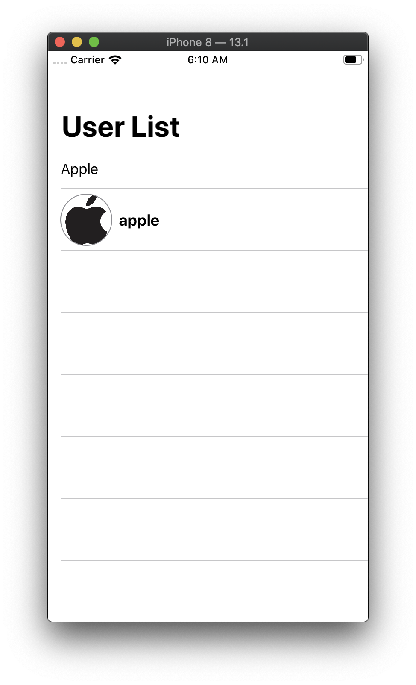
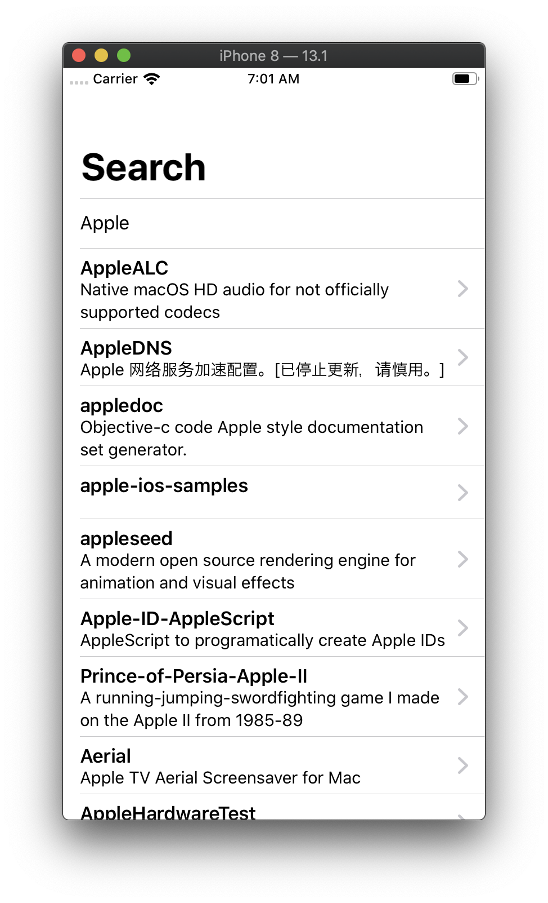

# Series of posts about building Redux-like Single Source of Truth in SwiftUI.

This repository is for learning Redux.

## Original Site
Single source of truth eliminates tons of bugs produced by creating multiple states across the app. The main idea here is describing the whole app state by using a single struct or composition of structs. A single state for the whole app makes it easier to debug and inspect.

* [Redux-like state container in SwiftUI. Basics.](https://mecid.github.io/2019/09/18/redux-like-state-container-in-swiftui/)
* [Redux-like state container in SwiftUI. Best practices.](https://mecid.github.io/2019/09/25/redux-like-state-container-in-swiftui-part2/)
* [Redux-like state container in SwiftUI. Container Views.](https://mecid.github.io/2019/10/02/redux-like-state-container-in-swiftui-part3/)

## Requirements

- Swift5.1
- Xcode 11.1
- iOS 13.0

## Snapshot

| | |
|----------|----------|
|  | |

## Changed

- Add Search User
- Add Load Users Thumbnail (not using Redux)
- It is abailable to replace fetching API to loading from local json. ※1

※1  replace "fetchApi" to "fetchMock"

SceneDelegate.swift
```
let store = Store<AppState, AppAction>(initialState: appState, appReducer: appReducer, dependencies: fetchApi)
```

## Using
- [SwiftUI-Combine](https://github.com/ra1028/SwiftUI-Combine)